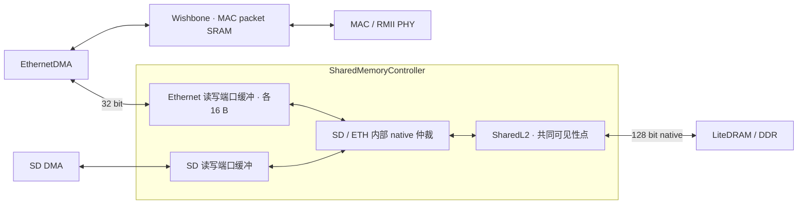

# Ethernet packet copy DMA

本分支保存尚未通过完整实板验收的 native DMA 实验。`place=2 / route=2` 时序通过，但实板 SD 初始化失败；不得将先前 Wishbone DMA 对照的网络验收用于本实现。构建身份、资源、失败诊断和复现参数见 [实验记录](ethernet-dma-experiment.md)。

`--with-eth-dma` 显式启用 DDR 与 LiteEth packet SRAM 之间的双向搬运引擎：DDR 侧使用与 SD 相同的 32-bit MemoryPort，内存控制器内部拼装 / 拆分 128-bit native burst；packet SRAM 侧使用 32-bit Wishbone，默认关闭。该开关依赖 `eth`，不改变 MAC / RMII / packet-slot 配置；两个 RX 和两个 TX slots 仍由原有 HAL 管理。

本次实验关闭 `audio` 和 `mic`（同时关闭 `mic_stereo`），保持 RV32IMAFC、sys 60 MHz、DDR CK 120 MHz、4 KiB ROM/L2、SD lite、LCD 和 USB ultra。对应独立 worktree 分支为 `codex/eth-dma-no-audio`。

## 描述符与完成

CSR bank 为 `eth_dma`，复用 HAL 已有的接口：`memory` 为 DDR buffer 地址，`slot` 为 packet-slot 基地址，`length` 为字节数，`control[0]` 为 enable，`control[1]` 为 RX 方向（slot → DDR）；`busy`、`done`、`error` 返回执行状态。每次只有一个描述符，执行期间使用捕获的地址、长度和方向。

DDR buffer 必须 16 B 对齐，长度 1..1536 B，不得越过 DDR 末尾或触及固定 boot RAM `0x407ff000..0x407fffff`。slot 必须是 2 KiB 对齐的合法 RX / TX 基地址：RX `0xb0000000`、`0xb0000800`；TX `0xb0001000`、`0xb0001800`。

每 16 B DDR burst 只提交一次 native 命令；packet SRAM 按 32-bit 字访问，并在相邻 cycle 之间释放 Wishbone。DDR read 返回先缓存在本端口；DDR write 收齐数据和 byte mask 后才参与内部仲裁。RX 尾字使用 byte select，保留 DDR buffer 范围外字节。TX 最后一个字的额外字节不会发送，MAC 发送长度仍由原有 HAL 提交。

每个 bus cycle 保持请求到 ACK/ERR。disable 不撤回已提出的 cycle，排空后回 idle；取消同时触发 MemoryPort 排空，停止 SRAM 访问仍等待该 cycle 的 ACK。RX done 等最后一个 burst 的内存 commit，TX done 等最后一次 SRAM write ACK 后出现，非法描述符直接以 error 完成。

## 软件与边界

HAL 的既有 `CSR_ETH_DMA_CONTROL_ADDR` 分支会自动启用：至少 64 B 且满足 buffer 对齐/地址条件时使用 DMA，否则保留 PIO。RX 在 DMA 完成前不释放 packet slot；TX 在 SRAM 填好后才提交 MAC 发送命令。HAL 当前同步等待完成，尚未改成中断或异步队列 API。

DMA 的 DDR 访问经过 SharedL2 native 入口，和 SD 一样不分配缓存行、可命中 CPU dirty 行。flush / invalidate / cache disable 同时等待已接纳的 SD 和 Ethernet 写缓冲提交。RX 完成后 HAL 执行原有 CPU D-cache 维护。它不绕开 CPU 私有 L1 一致性要求。

这是 packet SRAM ↔ DDR 的 copy DMA，保留现有 MAC SRAM，尚未实现 MAC 直接访问 DDR 的 descriptor ring 或 zero-copy NIC。

## 验证

`tests/ethernet_dma_verilog_test.py --iverilog C:/msys64/ucrt64/bin/iverilog.exe` 对生成 RTL 验证双向字节顺序、1..7 B 尾字、1514/1536 B 包、延迟 ACK、非法描述符、取消排空及重启。实际资源与 setup/hold 必须以完整 PnR 为准；外部 payload 验证需匹配 gateware/BIOS 后使用 UDP echo，并核对 HAL DMA RX/TX 计数。

当前为 CPU 逐包提交且 HAL 同步等待的 packet copy DMA；不是自动 descriptor ring。ring 需另行实现硬件描述符消费 / 更新、buffer ownership 和完成队列。
