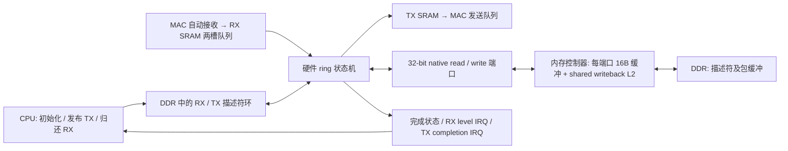

# Native Ethernet 描述符环实验

后续启用 DMA 后移除 PIO 兼容路径及对应 HAL 代码的最终构建与验收，见 [DMA 独占模式验收](ethernet-ring-exclusive.md)。本文保留首次 ring 实验的证据。

2026-10-09，分支 `codex/eth-ring-dma-no-fpu`：已经实现 RX/TX 描述符环，硬件自动处理 MAC 队列和 DDR 搬运。CPU 初始化环、发布 TX 描述符和回收 RX 缓冲，不再逐包配置复制 DMA 的地址/长度并同步等待。最终 ROM8K 全配置完成 PnR setup/hold 0/0、匹配镜像实板验收及真实外部收发。

工作树基于此前 rebase 到 `main e24a460` 后的 `5865db4`；ring 实现尚未提交，真实构建身份包含 dirty 源码指纹和保存的 patch/未跟踪输入，不能仅用 Git HEAD 复现。旧参考分支和复制型 DMA 的构建产物保留。

## 硬件结构和所有权

MAC packet SRAM 保留为收发暂存。包 SRAM 侧使用 Wishbone；DDR 中的描述符和数据都通过 native 端口访问。空环不轮询 DDR。共享状态机串行处理 RX/TX，用轮换优先级防止某一方向持续饿死另一方向；不是同时并行运行的两个独立 DMA 引擎。

每个描述符为 16 字节，必须 16 字节对齐：

| 字段 | 含义 |
| --- | --- |
| word0 | DDR 包缓冲地址，16 字节对齐 |
| word1 | RX 缓冲容量 / TX 帧长度 |
| word2 bit31 | OWN：1 表示交给硬件 |
| word2 bit30 | DONE：硬件已完成并交还 CPU |
| word2 bit29 | ERROR：非法描述符或传输失败 |
| word2 bits0..11 | 实际完成长度 |
| word3 | CPU cookie，硬件保持不变 |

CSR 设置 RX/TX 环基址、mask、RX consumer 和 TX producer；硬件发布 RX producer 和 TX consumer。序列计数为 16 bit，环位置为 `sequence & mask`。支持 1/2/4/8/16 项环，当前 HAL 使用 RX4 + TX4，缓冲为各 4×1536 字节，HAL 帧上限仍为 1514 字节。描述符及缓冲共占约 12.1 KiB DDR，没有新增 BSRAM。

RX 仅在有空闲描述符时搬运，数据经内存控制器确认后才发布 DONE、推进 producer 并释放 MAC slot。环满时保留已有包和未处理的 MAC slot；MAC 两槽也满后，新帧仍可能被 MAC 丢弃，不覆盖 CPU 尚未归还的缓冲。

TX 只消费 CPU 发布且 OWN=1 的描述符。完成 SRAM 搬运后自动提交 MAC 命令，等 MAC SRAM reader 的完成事件后才交还描述符。这里的 TX 完成表示 MAC 已消费暂存数据、相关缓冲可复用；不表示远端收到报文，也不是物理线路的独立发送完成测量。

硬件检查环范围、地址溢出、boot-RAM 保留区、描述符/数据重叠、buffer 对齐及 MAC MTU。非法帧长度不启动 MAC。停机时撤销新工作、等待 Wishbone ACK 和 native 端口排空后再初始化环。

## CPU 接口

HAL 新增 `hal_eth_rx_acquire/release` 和 `hal_eth_tx_acquire/commit`。每个方向同时最多一个软件 borrow；RX release 与 TX commit 都通过 fence 发布所有权。CPU 读取 DMA 写入的数据前清除私有 L1 的旧副本。stop 使旧 borrow 失效。

兼容的 `hal_eth_receive/send` API 保留：receive 会把 ring 帧复制到调用方缓冲，send 会把调用方数据复制到 TX ring，以保证异步发送期间的数据寿命。这些兼容拷贝不是逐包控制 MAC SRAM↔DDR DMA。回环路径已经直接借用 RX 帧进行解析，TX 默认经兼容 API 填入 TX ring；想直接构造 TX 帧的调用方可以使用 acquire/commit。

## 最终配置和资源

RV32IMA，无 FPU、无 C，Sv32 MMU、I/D cache、4 KiB L2；CPU/L2 60 MHz、DDR 120 MHz；ROM8K、SD lite native4、LCD、USB ultra、48 kHz DDS 音频和双麦克风均开启，place2/route2。未修改 Flash，XIP ring 配置尚未单独构建或验收。

| 项目 | 同配置复制型 DMA | ring DMA | 增量 |
| --- | ---: | ---: | ---: |
| Logic / 20736 | 17534 | 18707 | +1173 |
| Register / 16173 | 10168 | 10405 | +237 |
| CLS / 10368 | 9688 | 9999 | +311 |
| BSRAM / 46 | 42 | 42 | 0 |
| setup / hold | 0 / 0 | 0 / 0 | — |

剩余 2029 Logic、369 CLS、4 个 BSRAM。rPLL 3/4，PRIMARY/LW 均为 8/8。

最终 bitstream SHA256：`ea02c8411ddae060f09cc98aaaa351522fd8fe3a9f734f2052157fc92fffafd5`。

最终 app.img SHA256：`ab360bf3fae5174a392c3e37b350f92ed51a29b2f20c8607d3c53361f476f671`。

完整参数、源码和 CPU 身份、复现 recipe 见 [build-info.json](../build/ring-final-rom8k/build-info.json) 与 [validation.json](../build/ring-final-rom8k/validation.json)。

## 验证

- emitted ring RTL：一次提交多个 TX 后自动消费；RX/TX 轮换、环满背压、回绕、尾包掩码、cookie 保持、提交后发布所有权、非法地址/超长 TX、停机排空和重启通过。原 packet-copy RTL、配置、buffered ports、shared memory controller 和 shared L2 检查通过；PIO 配置另完成固件编译。
- 最终镜像完整板测通过，覆盖 SD、DDR/MMU/L2、LCD、音频、双麦克风、Ethernet 与 USB。60 秒并发完成 36 轮，audio underrun/error、LCD underflow 为零。
- CPU 停止收包处理一秒：RX producer 从 `0x000b` 前进到 `0x000f`，consumer 保持 `0x000b`。四个 UDP 数据报在 CPU 恢复后按顺序、完整回包。这证明收包和 descriptor completion 独立于 CPU 的逐包调用。
- 外部 ARP、ICMP 和 110 UDP echo 通过，覆盖 0/1/31/32/63/64/255/511/1024/1472 字节，30.76 秒、37983 payload 字节、零超时，最大 RTT 4.45 ms。最终 DMA RX/TX 计数 126/119，同时完成 SD/USB/LCD/音频检查，LCD/audio 错误为零。

真实网络、hold 检查和原始 UART 见 [外部验收报告](../build/ring-final-rom8k/external-verification.json)，50 项功能验收和最终恢复记录保存在 [ring-evidence](../build/ring-evidence/)。性能 all/cache 各三轮均通过，原始数据和同配置复制 DMA 对比见 [性能报告](../build/ring-performance/comparison.md)。L2 read 为 55.291 vs 54.953 cycles/access，CPU mul-add 为 40.550 vs 40.016 cycles/iteration，SD 4 KiB read 为 1.756 vs 1.778 MiB/s；两者 BIOS 和缓冲布局不同，不能单独归因于 ring 控制逻辑。cache 压力测试的 LCD 欠载在复制型和 ring 候选中均累计 24 次，普通并发及外部网络测试为零。结束后的 BIOS 检查通过。

当前验证是功能及短时并发验收，尚未测 100 Mbps 满速、长期突发丢包或复杂协议栈的零拷贝集成。未做听音、LCD 画面、USB 物理输入或掉电启动验收。实验结束恢复正式 `current`，不合并、不推送、不更改 current 引用或 Flash。
