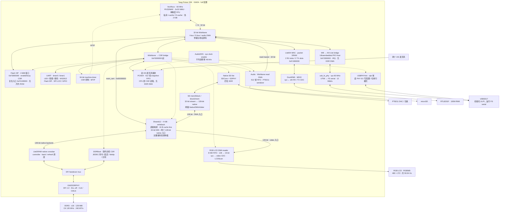
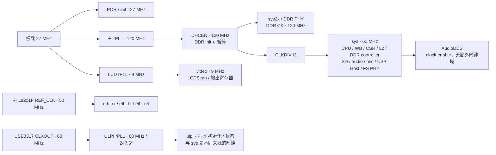

# Gateware 系统框图

检查日期：2026-10-08。图已同步合入 main 的 RAM 零基址/XIP 实验代码（e50809b），以已验收的 full 配置为依据：RV32IMAF、无片内 ROM、Flash 1 MiB 启动、4 KiB shared writeback L2、SD lite、USB ultra、DDS audio。匹配镜像 PnR、完整 BIOS 实板验收与三轮 all/cache 已通过，详见 [XIP 实验记录](xip-experiment.md) 和 [性能报告](../reports/performance/zero-ram-xip-vs-v0.7.1.md)。

RAM 零基址与高地址设备 MMIO 是默认布局，不增加布局 flag。启动方式仍可选 ROM/XIP；本图描述 --boot-mode xip 配置。C 扩展由输入 CPU RTL 决定，旧地址属性的 CPU 必须重新生成。

## 系统数据路径

实线表示访问或数据通路，双向箭头表示读写，虚线表示寄存器控制。省略每个模块重复的 CSR、复位和 IRQ 连线。

## 时钟与复位

主系统复位由 PLL lock、复位按键、DDR PHY 初始化和 SoC reset 共同参与；LCD 复位同步到 video 域。Ethernet/USB 的外部 PHY 共用 F10 复位输出。USB Host/桥接还有独立的软件复位，PHY 初始化域受 ULPI PLL lock、PHY reset 和 enable 控制。DDR init 时钟独立于可暂停的 sys2x/sys 路径。

Ultra PLL 与当前 `gateware/usb_ultra.py` 及 `docs/clocks.md` 一致，采用 247.5° 配置。

## 关键设计结论

- 启动时没有独立工作 SRAM：XIP 启动程序使用 L2 中固定的 `0x007ff000..0x007fffff` 4 KiB 窗口保存栈/data/BSS，软件经 DDRBoot 初始化与训练 DDR。handover 后由 LiteDRAM controller 接管 DFI，解除缓存固定；dirty tag 保留启动数据，后续替换时写回 DDR，不需要搬栈。
- L2 是三入口的共同可见性点：CPU 和音频共享 Wishbone 入口，LCD 使用只读 native 入口，SD 的两个方向先仲裁后使用 DMA 入口。一次只有一个完整事务拥有 L2 RAM/DDR 后端。流式请求不分配缓存行，但可命中 dirty 行；CPU RAM 访问（包括帧缓冲）可以分配 L2 行。
- L2 coherent 不等于整个缓存层级硬件一致：它不会 snoop CPU 私有 L1。软件仍需执行 DMA buffer 的 fence / D-cache 维护；不能据此推导 CPU/DMA 并发原子读改写保证。
- RGB LCD 是 DDR 帧缓冲扫描输出，两块 DDR 缓冲区由 base0/base1 CSR 指定，地址与槽选择在帧开始时锁存。当前 gateware 没有图形栅格化或 2D/3D 绘制引擎，像素由软件生成。
- 音频是 DDR 环形缓冲读 DMA，也支持 CSR PIO；麦克风是有限长度 snapshot capture，CPU 从 CSR FIFO 读出，尚无连续录音到 DDR 的 DMA。
- Ethernet 使用 MAC packet SRAM，CPU 负责 SRAM 与 DDR 之间的搬运；默认 USB 使用 PIO/FIFO，PHY 通过 ULPI 初始化后切到 serial FS，不能把 USB3317 的 HS 能力当成当前 Host 的 HS 支持。
- `full` 是功能组合，SD `lite` 是该外设内部的实现 profile；`filesystem` 是固件功能，不对应硬件文件系统引擎。可选 SD full / SPI、USB OHCI 不属于本图实例。

## 地址与中断

| 区域 | 地址 | 路径 |
| --- | --- | --- |
| Flash XIP | `0xf3000000..0xf33fffff` | Wishbone，只读、可缓存；Flash 物理 1 MiB 对应复位入口 0xf3100000 |
| DDR | `0x00000000..0x07ffffff` | SharedL2 → LiteDRAM → PHY |
| 启动栈/data/BSS | `0x007ff000..0x007fffff` | 训练前 L2 boot RAM，训练后普通 writeback |
| DDR 应用入口 | `0x00800000` | 固件链接约定 |
| LCD frame slots | base0/base1 CSR 指定 DDR 地址 | 每帧 261,120 B，16 B 对齐，完整帧必须位于 RAM 中 |
| Ethernet packet SRAM | `0xf1000000` 起 | Wishbone MMIO |
| USB Host | `0xf2000000` 起 | Wishbone → AXI-Lite，4 KiB 窗口 |
| CSR | `0xf0000000` 起 | 寄存器控制与状态 |

外设 IRQ 位：UART=0、timer0=1、timer1=2、board_io=3、SD=4、Ethernet=5、USB=6。machine timer 直接走 MTIP，是独立的 CPU timer interrupt。

## 资源与分析边界

已验收的 XIP 候选构建报告：Logic 19,562/20,736（94.34%），CLS 10,180/10,368（98.19%），BSRAM 40/46，rPLL 3/4，PRIMARY 8/8，LW 8/8；setup/hold violated endpoints 为 0/0。该布局剩余 CLS 很少，时钟网络也已占满，不能仅凭 LUT/PLL 的剩余数量判断新增模块可容纳性。数字取自本轮 merge-reviewed 构建；提交后的最终镜像和哈希通过构建 catalog 单独登记。

主要依据：`gateware/soc.py`、`shared_l2.py`、`ddr_boot.py`、`native_dma.py`、`sd.py`、`video.py`、`audio.py`、`microphone.py`、`ethernet.py`、`usb_ultra.py`，以及 gateware/memory_map.py、flash_xip.py 和合格构建的参数、validation、rtl-manifest.json / 顶层生成 RTL。

## 独立分支中的端口缓冲实验

用户于 2026-10-07 确认方向：DDR burst 的打包、拆包与每端口缓冲应收进共享内存控制器，外设端使用自然的数据宽度。主分支尚未合入这些改动，前面的图仍描述主分支当前实现。术语见 [内存子系统术语](../CONTEXT.md)。

该方向已在独立分支 `codex/buffered-memory-ports` 的 `e7586b0cf090439bfe28cbe1ba6852a5c2ad11d2` 实现并保存：SD 读写各为 32 bit，LCD 为 16 bit，每个流式端口有 16 B 缓冲；完整带音频配置通过 PnR、实板、并发 soak 和基准检查。另一个分支 `codex/eth-dma-no-audio` 的 `974da25b0f241c46f2cf0a5e919a8db330f3d8bb` 保存关闭音频后的 Ethernet native copy DMA 实验，PnR 通过但实板 SD 初始化失败，未通过完整验收。两者均暂不合并，不能把实验实现画成主分支现状。

外层 SharedMemoryController 包含端口适配器、共享仲裁和 SharedL2；后端仍接 LiteDRAM controller / PHY。SD 接口保持 32-bit stream，LCD 可使用 16-bit pixel stream（也可先以 32-bit 数据接口接入），CPU 保持 32-bit Wishbone。每个流式端口以一个 16 B burst 缓冲起步；深 FIFO 仍负责长期速率差与跨域。

读事务返回的数据先保存到目标端口的缓冲，随后释放共享后端，端口独立按客户端宽度交付。写事务先在本端口收集数据和 byte mask，形成完整 burst 或明确的部分尾包，再进入共享仲裁，避免慢客户端占住全局事务。端口的数据接收完成与内存提交完成必须区分，DMA done / flush 必须覆盖尚未提交的端口缓冲。

端口读缓冲按已接受请求的返回数据消费，不作为可无限重复命中的额外缓存。若以后支持同一地址重复命中，必须加入重叠写失效/更新或软件明确的所有权契约，避免 CPU/其他 DMA 修改后读到旧数据。所有数据访问继续经过共享 L2 的共同可见性点。
