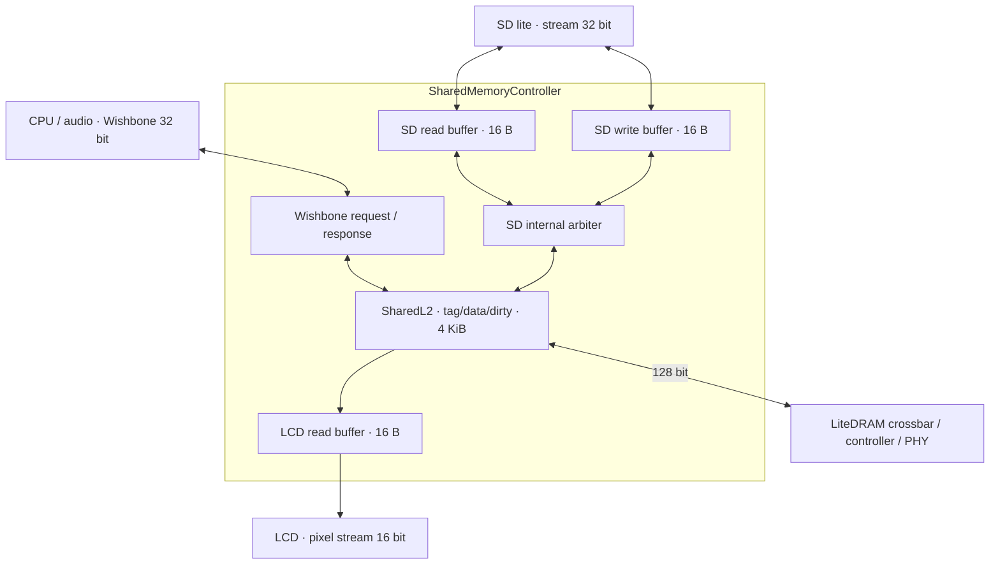

# 共享内存控制器与端口缓冲

`gateware/memory.py` 的 `SharedMemoryController` 管理外设端口的 burst 缓冲、内部仲裁和共享 writeback L2；后端仍是 LiteDRAM controller / PHY。CPU 和音频保留 32-bit Wishbone，LCD 接口为 16-bit 像素流，SD lite 的读、写接口各为 32-bit 数据流。DDR 的 128-bit burst 不再跨到 SD/LCD 模块。

## MemoryPort 契约

每端口最多一个 outstanding command。`cmd.addr` 是相对于 DDR 起点的 16 B 行地址；`cmd.count` 是本命令要传输的窄字数量，16-bit 端口为 1..8，32-bit 端口为 1..4。数据从行内第一个字开始，未对齐起点目前不支持。`cmd.we` 选择方向；read-only / write-only 端口和零长度、超长命令不会被接受，客户端须在提交命令前验证参数。

读响应完整存入端口的 128-bit 暂存寄存器后立即释放内部仲裁，再按客户端宽度交付；`rdata.last` 标记本命令最后一个窄字。缓冲是一次请求的快照，消费后失效，不支持同地址重复命中的私有缓存。LCD 的深 8 KiB FIFO 和 video CDC 仍独立负责速率差、服务间隙与跨域。

写端口先接收 `count` 个窄字及各自的 byte mask；收齐后才向内部仲裁器提出一个 native burst。每端口的 byte mask 在新命令时清零，因此不足 16 B 的尾包不会覆盖范围外的数据。`wdata.ready` 只表示进入端口缓冲，`done.valid/ready` 则表示该写事务已经进入共同 L2 或完成 DDR 提交。DMA done 必须等待后者；这里没有新增软件可见的提前完成语义。

## 停止与维护

`cancel` 丢弃尚未收齐的写 burst 和尚未交付的读数据。native command 一旦提出，即使尚未收到 ready，也保持 valid、地址和数据到接受，再排空事务；这样不会撤回内部仲裁器已选中的请求。取消的事务不返回过期读响应或写 completion。SD 控制器的软件复位也触发这一路取消，不独立复位正在排空的内存状态机。

flush、invalidate、缓存禁用会暂停接收新的 SD 写命令，等待已接收的端口写入提交，随后才开始 L2 维护。收集中的旧写 burst仍可继续接收数据；已经提交、仅等待客户端领取的 completion 不阻塞维护。取消未完成的收集可解除等待。调用方应先停止生产新 DMA 工作，再发起维护。

端口缓冲不 snoop CPU 私有 L1；HAL 原有 DMA buffer fence / D-cache 维护继续适用。CPU Wishbone 请求仍由 L2 捕获并在修改可见后 ACK，未新增 CPU 私有 burst cache。

## 验证

- `tests/memory_ports_test.py`：真实 L2 与端口缓冲，LCD 背压/SD 部分写不阻塞其他入口，byte masks、尾包、dirty 数据可见性、flush 等待提交、取消/重新启动、未接受 native offer 的排空。
- `tests/memory_controller_verilog_test.py`：生成的整个共享内存控制器在 Icarus 中验证 CPU/SD/LCD 同时工作的握手、lane、byte mask 和提交边界。
- `tests/native_sd_verilog_test.py`：SD 32-bit 客户与内存侧 buffer 的生成 RTL，验证四字顺序和完整掩码。
- `tests/lcd_memory_verilog_test.py`：生成的 LCD / buffer / FIFO / CDC RTL，独立 sys/video 时钟，验证启动排空后两帧显示的像素顺序、地址边界、帧结束标志和无 underflow。
- 原有 L2、boot RAM、DDR/DFI 回归继续运行。实际 full PnR 与实板结果分别记录，仿真通过不等于实板验收。
