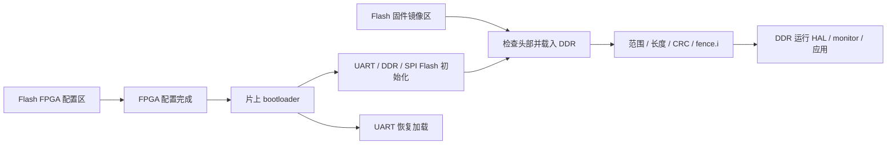

# 外围设备 HAL 与板级控制器计划

日期：2026-10-01。原规划基线为 M4，提交 `d3f2b2326aeb783ba54b43ae49db1352d066f0d6`。本页保留外围控制器的方案和引脚核对；Flash/UART 启动已实现，当前单一基础系统见 [bootloader](bootloader.md) 和 [基础版验证](base-validation.md)。其他新增外围控制器仍是后续计划。

## 1. 本轮确定的范围

- 保留 VexRiscv lite、CPU/sys/Wishbone 60 MHz、DDR CK 120 MHz DLL-off CL6/CWL6；暂停提频与 CPU/DDR 解耦。
- 保留 480×272 RGB565 DDR 双缓冲、9 MHz 并行 RGB LCD，以及 240×135 SPI LCD；HDMI 暂缓。
- 补齐 UART、timer、GPIO、WS2812B、Flash、原生 SD 四位接口、音频输出、Ethernet MAC/PHY、USB Host 的 CPU 接口与 C/C++ HAL。
- 用户修正 DIP 数量；按原理图记录为四位用户 DIP，加一位 B10/RECFG 配置开关。
- USB 使用 Host 模式接键盘等设备。首轮目标是直接连接的 LS/FS HID 键盘、鼠标；Device/CDC 不作为当前交付目标。
- 用户接受固件存放 Flash，片上仅保留小型 bootloader 和必要工作存储。推荐 Flash 保存程序、DDR 执行；XIP 后续评估。

“暴露给 CPU”包含寄存器、传输缓冲、错误/状态、完成通知和软件接口。只读取 PHY 寄存器不能算 Ethernet 或 USB 可用；两者还需要 FPGA 内的 MAC/Host 控制器和 CPU 软件。

## 2. 核对依据和当前状态

本地路径相对于父目录 TangPrimer-20K；原理图页号为 PDF 从 1 开始的页号。

| 依据 | 用途 |
| --- | --- |
| `docs/02_Schematic/Tang_Primer_20K_Dock-3713_Schematics.pdf`，Rev 1.1 / 2023-09-12，第 1、5、6、7、9 页 | FPGA 引脚、USB3317、RTL8201F、PT8211、LED/按键/DIP/WS2812B、共享信号 |
| `docs/02_Schematic/Tang_Primer_20K_Core_board_3690_Schematic.pdf`，Rev 0.0.2，第 1 页 | 核心板 microSD、W25Q32JVS、SPI LCD、配置引脚 |
| `examples/USB/usb_serial` | ULPI 引脚、PHY 操作和 FIFO 参考；这是 Device 串口示例 |
| `examples/Ethernet/verilog_UDP/udp_18k` | RMII 引脚、MDIO、固定 ARP/UDP 示例；不直接等于 CPU 通用 MAC |
| `examples/PT8211` | DAC 引脚和波形参考；需修正普通 I²S/声道和采样率理解 |
| `examples/WS2812` | 单像素串行时序参考；以 60 MHz 重算时序 |
| `examples/RGB_lcd/480x272_4.3inch_lcd`、`examples/SPI_lcd` | 已接入并上板验证的两块显示屏 |
| `gateware/soc.py`、`gateware/board.json`、`firmware/drivers/`、`requirements.in` | 当前 SoC、频率、软件接口和固定依赖 |
| `build/m4/gateware/impl/pnr/project.rpt.txt` | 当前资源占用，非未来估算 |

M4 已通过用户要求的五分钟并发验收（实际 390.344 秒），两块屏幕由用户确认正常稳定。当前基线保留 UART、timer、DDR、两块 LCD、SPI-SD/FatFs，并新增独立 SPI Flash CPU 接口与 Flash/UART bootloader。原生 SD、音频、Ethernet、USB Host 尚未接入。启动汇编尚无完整 trap/IRQ runtime，后续须补齐。

本轮把上述新增引脚清单与 M4 生成的 `riscv_mini.cst` 做了静态比对：新增设备之间的重复脚为已识别的 F10；与现有功能重叠的是 T10 复位和 SD 的原 SPI 引脚。该检查不代替 bank 电压、时钟专用引脚、配置复用和布局布线验收。

## 3. 硬件清单与引脚

### 3.1 GPIO、按键、开关

| 设备 | 原理图顺序及 FPGA 引脚 | 电气/使用约束 | HAL 目标 |
| --- | --- | --- | --- |
| 六个单色 LED | Orange_LED[0..5]：C13、A13、N16、N14、L14、L16 | 低电平亮；C13/A13 是 DONE/READY 复用脚，配置完成后使用 | `led_set_mask()`、单灯设置、默认全灭 |
| 一个 WS2812B | T9 | 原理图 U17；型号是 WS2812B。数据线另通 MIC_LED 接口 | RGB→GRB、硬件脉宽、busy/完成、复位低电平锁存 |
| 五个按键 | Key1..5：T10、T3、T2、D7、C7 | 低有效，有 RC。Key1/T10 当前作为系统复位；其他四键独立用户输入 | 用户按键同步、去抖、按下/释放事件；T10 保留复位角色 |
| 四位用户 DIP | E9、E8、T4、T5 | ON 为高；同步后返回稳定值 | `switch_read()` 返回四位逻辑值 |
| FPGA 配置开关 | B10/RECFG | 原理图五位 DIP 的第一位；保留硬件配置用途 | 板级说明，不作为普通应用 GPIO 改写 |

LiteX 平台 LED 编号顺序是 L16、L14、N14、N16、A13、C13，与原理图 Orange_LED[0..5] 相反。HAL 使用明确的板级逻辑映射，避免程序观察与丝印不符。配置复用选项在现有平台中已开启，但新增模块仍需验证配置期间的安全电平。

Key1 是 3.3 V 上拉，另外四键是 1.5 V 上拉；四位用户 DIP 也接 1.5 V。输入约束依据真实 bank 电压，不统一套 LVCMOS33。按键两级同步后去抖约 5–10 ms。WS2812B 由硬件生成高低脉宽，初始帧间低电平留约 300 µs 保守余量，CPU 仅提交 24 位颜色。

用户提到“额外 FPGA 复位 switch”的实物丝印/位置尚待核对；本计划不凭描述额外分配未知引脚。T10 系统复位、B10 RECFG、USB 模式开关是不同信号。

### 3.2 Ethernet

Dock U9 是 RTL8201F-VB-CG，10/100 Mbps PHY，以 RMII 连接 FPGA。

| 信号 | 引脚 |
| --- | --- |
| REF_CLK / PHY 提供的 50 MHz | A9 |
| RXD[0:1] | F15、C9 |
| TXD[0:1] | D16、E14 |
| TX_EN / CRS_DV / RX_ER | E16 / M6 / L8 |
| MDC / MDIO | F14 / F16 |
| RESET_N | F10，与 USB PHY 共用 |

先用 MDIO 扫描 PHY 地址、读 ID/链路/协商状态，再接 LiteEth RMII MAC 的 Wishbone 帧接口。启动阶段 CPU 收发原始 Ethernet 帧，验收 ARP、ICMP 或 UDP；TCP/IP 完整协议栈可后续加入 lwIP。示例硬编码 PHY 配置不能直接代替通用驱动。

RMII 50 MHz 与 sys 60 MHz 之间用异步 FIFO。MDC 初始约 1 MHz，以 sys clock-enable 分频，无额外 PLL。先用有限数量的片上 RX/TX packet slots，避免未经验证的直接 DDR DMA；后续环形缓冲再接系统总线。

MDIO/MDC 的 F16/F14 与 HDMI DDC、屏幕触摸/摄像头的 I²C 路由复用。当前 RGB 像素输出不冲突；接 Ethernet 时保留这两脚给 MDIO，未来触摸需要独立评估总线所有权。

### 3.3 USB Host

Dock U6 是 USB3317，独立 26 MHz 参考振荡器，ULPI CLKOUT 为 60 MHz。该 PHY 接 Dock 的 OTG USB-C 接口，与 BL702 调试 USB 接口分开。

| 信号 | 引脚 |
| --- | --- |
| CLKOUT | T15 |
| DATA[0..7] | G11、H12、J12、H13、T14、R13、P13、R12 |
| STP / DIR / NXT | K11 / K12 / K13 |
| RESETB | F10，与 Ethernet PHY 共用 |

推荐优先验证：LiteX/SpinalHDL OHCI + USB3317 6-pin FS/LS serial 模式适配 + TinyUSB Host 的 OHCI/HID 软件移植。初始化仍通过完整 ULPI 总线进行；serial 模式是 PHY 可配置的工作方式，不表示原理图只接六根数据脚。

1. sys 域公共复位模块驱动 F10，等待 PHY 时钟恢复；复位期间 USB CLKOUT 会停止，复位发生器不能依赖该时钟。
2. 在 PHY 60 MHz 域完成 ULPI ID/寄存器操作、Host 终端设置，再进入 serial 模式；按手册管理 ClockSuspendM、STP 和数据总线方向。
3. OHCI 首选独立 48 MHz PHY 域，CPU 控制与 DMA 侧保持 sys 60 MHz。重新封装现有 OHCI D+/D− 接口，适配 PHY serial 信号和 LS/FS 速度切换。不能把 D+/D− 端口直接当作 FPGA 管脚连出。
4. OHCI 控制 MMIO、IRQ、HCCA/ED/TD 及传输缓冲暴露给 CPU；TinyUSB 移植根端口复位、枚举、控制传输和 HID interrupt-IN。
5. HAL 输出原始 HID report 与键盘按下/释放、修饰键、鼠标位移/按键事件；ASCII/键盘布局属于上层输入处理。

首轮验收直接连接的低速/全速 Boot HID 键盘、鼠标，包含拔插重枚举和复位后恢复。复合设备/Report Protocol 逐步扩展；Hub、MSC/U 盘、USB Audio 和 480 Mbps 高速 Host 不纳入首轮承诺。PHY 具备高速能力不等于 OHCI 能高速运行。

本地 LiteX 已包含 `usb_ohci.py`，但环境尚未安装 `pythondata-misc-usb_ohci` netlist 包和 TinyUSB；需固定版本、核对许可/生成链并补入 lock。OHCI/serial bridge 和 TinyUSB 的结合尚未在本项目验证，先独立做 PHY/枚举试验，再合入全系统。UltraEmbedded 简化 USB Host 仅验证 FS，不能直接承诺覆盖常见 LS 键盘，因此不作为首选。

USB 模式硬件开关需拨到 Host。原理图 VBUS 直接连板上 5 V，CPEN 未连接可控供电开关；HAL 不提供虚构的 VBUS 断电能力。使用实际 OTG 转接器验证供电、连接检测与枚举。

### 3.4 音频

Dock U10 是 PT8211-S，16 位双声道输出 DAC，后接模拟电路、LPA4809 功放及耳机插座；板载这一路不具备 ADC 录音功能。

| 信号 | 引脚 |
| --- | --- |
| BCK / DIN / WS / PA_EN | N15 / P15 / P16 / R16 |

采用 PT8211 的 LSB-justified/right-justified 格式，16 位二补码、MSB 先传。原厂时序 WS 低为右声道、高为左声道；本地例程相反的注释不能当作依据，左右独立音调上板确认。

第一轮由 sys 60 MHz 整数分频产生 BCK 1.5 MHz，32 BCK/立体声帧，对应采样率 **46,875 Hz**。使用 sys clock-enable，避免新增 fabric clock/PLL；这也接近例程的真实 6 MHz÷4 输出，不将其标成 48 kHz。

先做 CPU FIFO 喂数和左右声道音调，再加 DDR PCM 环形缓冲与有界 DMA；带宽为 187,500 B/s。缺样输出零、计 underrun，复位/暂停先静音并关闭 PA_EN。精确 44.1/48 kHz 属后续时钟方案，需要量化误差和抖动；本轮先完成有效音频接口。

### 3.5 原生 SD 四位接口

microSD 在核心板 J2，所有四根数据线均已接 FPGA。

| 信号 | 引脚 |
| --- | --- |
| CLK / CMD | N10 / R14 |
| DAT[0..3] | M8、M7、M10、N11 |
| Card Detect | D15 |

采用已锁定的 LiteSDCard：SDPHY + SDCore + Wishbone block-to-memory / memory-to-block DMA。这里是原生 SD memory 协议（用户所说非 SPI 的 SDIO），首轮不承诺 SDIO Wi-Fi 等 I/O function 卡。

初始化 400 kHz、一位数据；协商后四位 SDR、15 MHz。sys 60 MHz 下当前 clocker 用对称整数分频，15 MHz 易于实现；30 MHz 超过标准速度默认上限，20 MHz 的奇数分频也不能简单声称准确得到。首版无须另一个 PLL；理论四位数据位率 7.5 MB/s，实际文件吞吐另测。

覆盖 CRC7/CRC16、SDSC/SDHC 寻址、命令/数据/busy 超时、插拔恢复、单块和多块读写。复用现有 FatFs，上层文件 API 保持，替换 `diskio` 的 block backend。SD DMA 经 sys Wishbone 进入 DDR，不新增独立 DDR PHY 或第二物理 native 端口。

SPI 与原生 SD 共用引脚，只能选择一个控制器拥有这些脚。保留 M4 SPI 构建作为回退；原生配置独立验收后再成为新阶段默认。测试只读取现有数据或创建独立新文件，不格式化或覆盖既有文件。

### 3.6 SPI NOR Flash 与启动

原理图核心板 U9 标注 W25Q32JVS，32 Mbit / 4 MiB；本机实测 JEDEC `0x0b4017`，XTX 64 Mbit / 8 MiB。当前驱动按已支持的 JEDEC 检测物理容量，首版统一保护 `[0,2)` MiB FPGA 配置区，只允许 CPU 擦写 `[2,4)` MiB 应用区，额外 `[4,8)` MiB 暂时保留。以下段落为原规划，实际镜像格式和分区以 bootloader 文档为准。

| 信号 | 引脚 |
| --- | --- |
| CS_N / CLK / MOSI / MISO | M9 / L10 / R10 / P10 |

WP/IO2、HOLD/IO3 通过电阻拉高，未接 FPGA，因此按 **单线 SPI** 使用。芯片自身支持 Quad 不代表本板能接 QSPI。采用 LiteSPI，初始 10 MHz（60 MHz÷6），CPU 能读 JEDEC ID、状态、内容；随后提供受分区限制的 page program/sector erase。现有平台有配置脚转 GPIO 选项，仍需验证配置结束后的 CS/CLK 所有权。

启动布局：



bootloader 目标 8–16 KiB ROM、4–8 KiB SRAM，最终以 link map、DDR 初始化工作集和异常栈深度为准。主程序 `.text/.rodata/.data/.bss`、正常栈和堆放 DDR；bootloader 自身不依赖尚未初始化的 DDR。保留 I-cache、LCD FIFO、必要外设 FIFO，不能把这些运行存储全部去掉。

镜像头包含 magic/version、SoC/CSR ABI 标识、载入地址、长度、入口、CRC32。边界检查拒绝覆盖 bootloader 工作区、DMA 保留区和视频区；CRC 是完整性检查，不描述为签名认证。当前按用户要求简化 Flash 安装：只擦除和编程，不做写后读回校验，镜像头最后写入；加载时检查镜像并执行指令缓存同步。

Flash 配置区、固件区、可写数据区分别保护。确切偏移在核对 Gowin 实际配置镜像长度、格式/压缩、擦除粒度后由脚本生成，不凭当前 `project.bin` 文件大小硬定。默认禁止 chip erase，也禁止 CPU 擦写配置区；固件更新的上电安全策略先用有效标记/恢复入口，双镜像是否能容纳由 4 MiB 容量预算决定。

M5 可以先用 UART 下载 DDR 镜像验证 bootloader，避免“把完整应用仍嵌在 ROM 再复制到 DDR”造成片上资源没有减少。随后完成 Flash 固件区烧录与冷启动，交付用户要求的 Flash 存储启动。

## 4. 时钟、复位和资源

### 4.1 计划时钟

| 域/接口 | 频率与来源 | 新增 PLL |
| --- | --- | --- |
| CPU / Wishbone / CSR / DMA 控制 | 60 MHz，现有 DDR PLL / CLKDIV | 0 |
| DDR CK / PHY sys2x | 120 MHz，现有 PLL | 0 |
| DDR init / POR | 核心板 27 MHz | 0 |
| RGB LCD | 9 MHz，现有视频 PLL | 0 |
| RMII | PHY 输出 50 MHz，独立域 | 0 |
| USB ULPI 初始化 | PHY 输出 60 MHz，独立域 | 0 |
| OHCI PHY | 首选 48 MHz，独立 PLL，控制/DMA 为 sys 60 MHz | 预计 1 |
| 原生 SD CLK | 400 kHz / 15 MHz，sys 分频 | 0 |
| SPI LCD / Flash | 6 MHz / 首版 10 MHz，sys 分频 | 0 |
| Audio BCK / WS | 1.5 MHz / 46.875 kHz，sys 分频 | 0 |
| WS2812B | 约 800 kbit/s，sys 定时状态机 | 0 |
| UART | 115200 baud，sys 分频 | 0 |

USB PHY 的 60 MHz 与 CPU 的 60 MHz 异步，不可因频率相同省略 CDC。OHCI PHY 和 USB serial 引脚之间的接收同步/过采样按 core 设计核查，不能将串行电平粗暴当作字节 FIFO。各域复位异步断言、同步释放；F10 公共 PHY 复位由持续运行的 sys/POR 域控制。

### 4.2 当前资源约束

| 项目 | 当前 M4 PnR |
| --- | ---: |
| Logic | 7,633 / 20,736，37% |
| BSRAM | **46 / 46，100%** |
| rPLL | 2 / 4，50% |
| PRIMARY | 4 / 8 |
| LW | 8 / 8 |

原 M4 ROM 为 48 KiB、SRAM 16 KiB，boot.bin 为 33,136 字节。当前基础版已将应用移到 Flash/DDR，ROM/SRAM 均为 8 KiB，BSRAM 占用 16/46；boot 镜像 6,568 字节，DDR app 镜像 19,468 字节。优先把腾出的 BSRAM 分给 SD/USB/Ethernet/audio 的必要短缓冲，长缓冲在 DDR；小控制 FIFO 可采用 LUTRAM。

PLL 总数初步够用，但 BSRAM 推断粒度、长线/时钟布线和新增 OHCI Logic 必须重新 PnR。不能用“剩 63% Logic”保证所有外设一定同时装得下。每阶段记录资源增量；若超预算，先减 packet slots/FIFO 与调试模块，避免削弱 DDR/LCD 已验证的可靠性。

### 4.3 DDR 访问策略

保留 M4 的单物理 native 端口、显示优先、CPU/sys Wishbone 路径和现有事务隔离。SD/OHCI DMA master 接 Wishbone，最终共用同一 DDR 访问入口；音频和未来 Ethernet DMA 也遵循该路径。

新增有界 burst、主设备公平性和完成归属检查：视频保持 FIFO 安全余量，音频满足定时需求，SD/网络不能长期占总线，CPU 必须保持进展。大 ring buffers/描述符按所属设备分区，固件、视频、boot/test 区边界由 linker/配置生成；CPU 与 DMA 的 ownership 转移配合 memory barrier。

目前无 D-cache，DMA cache-maintenance hooks 可为空操作并保留接口。DDR 程序加载仍要处理 I-cache。视频读取约 15.65 MB/s，音频约 0.188 MB/s；Ethernet 100 Mbps 线速、SD 7.5 MB/s 原始位率不等于当前 DDR 桥或 CPU 实际承载能力，必须实测瓶颈。

## 5. HAL 软件边界

推荐目录：

```text
firmware/boot/              小型 stage-1、恢复加载、镜像校验
firmware/hal/include/hal/   C API，C++ extern "C" 可用
firmware/hal/src/           设备与 DMA/IRQ 实现
firmware/hal/boards/        Tang Primer + Dock 引脚角色/能力
firmware/monitor/           命令解析、诊断、人工验收
firmware/middleware/       FatFs、TinyUSB Host，后续 lwIP
firmware/apps/             DDR 链接的应用
gateware/peripherals/      新控制器及板级桥接
```

| 模块 | 面向应用的能力 |
| --- | --- |
| board / status | 硬件能力、时钟、reset reason、统一错误/统计 |
| time / irq | 单调时间、deadline、machine trap、IRQ 分发、短 ISR + 延后任务 |
| uart / spi | 收发/事务、超时、实际分频、FIFO 状态 |
| gpio / ws2812 | 逻辑 LED、四用户键事件、四 DIP、彩灯非阻塞更新 |
| block / sd | 512-byte block、容量、介质状态、多块请求、FatFs backend |
| flash | ID/读写、分区、erase/page 边界、busy、受保护范围 |
| audio | PCM16 stereo、采样率、队列、start/stop/mute/underrun |
| eth | PHY link、MAC 地址、原始帧收发、丢包/CRC 统计 |
| usb_host / input | 根端口/枚举状态、设备信息、传输结果、HID 事件 |
| display | 帧缓冲获取/提交、VBlank 换帧、underflow、SPI LCD |
| dma | 对齐、地址范围、描述符/缓冲所有权、完成/取消、barrier |

生成 CSR 头仅由 HAL backend 依赖，应用不硬编码 CSR 基址。统一状态包含 OK/BUSY/TIMEOUT/NO_MEDIA/CRC/IO/UNSUPPORTED/INVALID 等；失败返回传输进度和原因，不无限等待。快外设提供 start/poll/cancel 或队列方式，同步函数是带 deadline 的包装。

先保持裸机静态分配和合作式 `hal_poll()`，IRQ 仅搬运小事件/确认状态，文件系统、枚举和命令处理在主循环执行。后续 RTOS 增加 wait/wakeup/critical hooks，无需改 HAL 的设备 API。时间基准要处理 32 位 60 MHz tick 约 71.58 秒回绕，不能用普通大小比较判断长期 deadline。

## 6. 实施顺序与验收

| 阶段 | 工作 | 交付与验收 |
| --- | --- | --- |
| M5a：HAL 基础与板级 IO | 现有 UART/timer/SPI/显示/SD 接口包入 HAL；trap/IRQ 基础；LED、四用户键、四 DIP、WS2812B；公共 PHY reset 资源定义 | API 示例，GPIO 极性/去抖，按键事件不重复，六灯和彩灯人工确认；现有 M4 功能回归 |
| Flash + 两级启动（当前已实现） | 独立 LiteX SPIMaster、受限分区；小 bootloader、DDR 应用 linker、镜像头、UART 恢复；固件存 Flash、载入 DDR | JEDEC/CRC、错误镜像拒绝、读写范围保护；应用 DDR 执行；持久配置/冷启动验证以基础版验证文档为准 |
| M6：原生 SD | LiteSDCard 四位 15 MHz、DMA、FatFs backend；保留 SPI fallback 构建 | 文件 CRC、多块传输、新文件写回、拔卡超时/插回恢复、LCD 不欠载 |
| M7：音频 | PT8211 序列器、PIO FIFO→DDR PCM ring/DMA | 左右独立音调、46.875 kHz 实测/逻辑验证、静音、缺样补零及统计；显示/SD 同时运行 |
| M8：Ethernet | MDIO、LiteEth RMII MAC、原始帧 HAL、少量 packet slots、IRQ | PHY ID/链路、ARP/ICMP/UDP、收发 CRC/丢包、拔插网线恢复；不要把 link-up 当作 MAC 验收 |
| M9：USB Host HID | 固定 OHCI netlist/TinyUSB；USB3317 初始化/serial bridge；48 MHz 域和 DMA/IRQ；键盘鼠标事件 | LS/FS 枚举、按下/释放/修饰键、鼠标、拔插和复位恢复；与 Ethernet 共用 F10 的联动恢复 |
| M10：系统收尾 | DMA fairness、统一 reset/错误统计、文档/示例、全部设备同时启用 | 用户指定 **五分钟** 并发运行：DDR/LCD+SD+audio+网络+HID+monitor；无内存错误、无 LCD 欠载、CPU 可响应；各设备断开能恢复 |

每个新增高速/跨域控制器做针对性仿真或协议检查，Gowin 综合/PnR 核查资源与相关 setup/hold，再上板。新增布线/资源失败时在独立构建配置处理，保留 M4 bitstream 和源码作为基线。五分钟是当前综合压力验收范围，不延长到三十分钟。

USB PHY/控制器选型可在 M5b 释放资源后提早做独立枚举探针，尽早发现接口/供电问题；按上表顺序合入，不把 USB 风险拖到最后才研究。全套外设的最终资源与性能仍待实际综合和上板，当前不宣称已经支持。

## 7. 尚待硬件核对

- 额外复位 switch 的丝印与位置；目前确定 T10 是系统复位键，B10 是 RECFG 配置开关。
- USB Host 模式开关位置、OTG 转接器、实际键盘/鼠标的 VID/PID 与设备速度；实施时读取即可，无需先阻塞 HAL/启动工作。
- Flash 实际 JEDEC ID、有效配置区边界和烧录布局；上板只读探测后生成分区。

## 8. 外部一手资料

- [Microchip USB3317 数据手册](https://ww1.microchip.com/downloads/aemDocuments/documents/UNG/ProductDocuments/DataSheets/00002366A.pdf)：ULPI、RESETB/CLKOUT、6-pin FS/LS serial 模式及供电。
- [LiteX OHCI wrapper](https://github.com/enjoy-digital/litex/blob/master/litex/soc/cores/usb_ohci.py)：sys 控制/DMA、独立 PHY 时钟、netlist 参数与生成。
- [SpinalHDL OHCI](https://github.com/SpinalHDL/SpinalHDL/blob/dev/lib/src/main/scala/spinal/lib/com/usb/ohci/UsbOhci.scala)、[TinyUSB](https://github.com/hathach/tinyusb)：控制器和 Host/HID 软件候选，需移植验收。
- [UltraEmbedded Host](https://github.com/ultraembedded/core_usb_host)、[ULPI wrapper](https://github.com/ultraembedded/core_ulpi_wrapper)：FS-only Host 的限制与 UTMI/ULPI 桥参考。
- [PT8211 原厂手册](https://www.princeton.com.tw/LinkClick.aspx?fileticket=S9pGNkngU-k%3D&language=en-US&mid=13928&portalid=0&tabid=3476)：LSB-justified、16 位双声道与 WS 声道极性。
- [LiteEth](https://github.com/enjoy-digital/liteeth)、[LiteSDCard](https://github.com/enjoy-digital/litesdcard)、[LiteSPI](https://github.com/litex-hub/litespi)：候选 FPGA 控制器。
- [tang_computer serial-mode Host 参考实现](https://github.com/kami4ka/tang_computer/blob/main/gateware/usb_host.py)：同类板上的 OHCI/USB3317 适配思路，作为参考源码；其描述的接线与本地原理图存在差异，以本地原理图为准，不直接复制 CDC 或复位实现。
