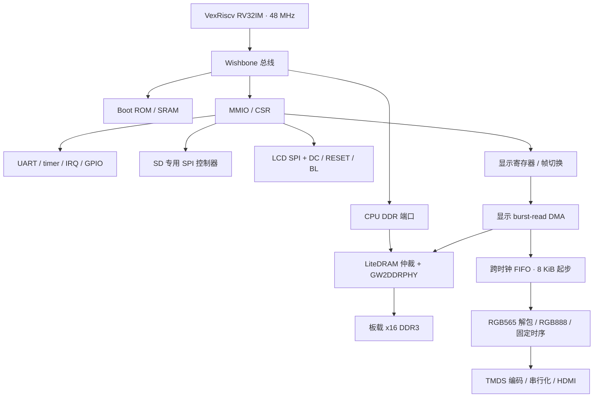

# Tang Primer 20K + Dock 3713：RISC-V 小型系统规划

原始硬件资料与示例位于本仓库的同级 `../docs/` 和 `../examples/`，不包含在本仓库中。文中 `docs/01_*`、`examples/*` 等证据路径相对于 TangPrimer-20K 工作目录。

日期：2026-09-30。状态：开发环境、M0 UART、M1 DDR 和 M2 SPI LCD / SD 已完成实际构建与上板验证。DDR 地址/数据模式测试及 DDR 代码/栈执行通过；LCD 颜色、文字方向和画面范围经用户确认；SD 新文件写回与 CRC 校验、拔卡报错和插回重新挂载通过。实体按键和断电冷启动尚待验收；HDMI framebuffer 为下一阶段 M3。详见 [M1 验证](m1-validation.md) 和 [M2 验证](m2-validation.md)。

用户确认：裸机 C/C++ + UART monitor 起步，后续可加 RTOS；SPI LCD 为 examples/SPI_lcd 对应的 1.14 英寸 240×135 屏；可以使用 Gowin FPGA Designer 和厂商 IP；实际 DDR 颗粒为 SK hynix H5TQ1G63EFR。

## 1. 推荐配置

采用 LiteX 构建可再生成的 SoC，单核 VexRiscv RV32IM、Wishbone 总线、LiteDRAM GW2DDRPHY，Gowin 综合与布局布线。CPU 初始目标 48 MHz；无 MMU/FPU，保留 machine-mode CSR、异常、UART/定时器/外设中断。指令缓存目标 4 KiB；第一版关闭数据缓存与 DDR L2 缓存，简化显示 DMA 和 CPU 之间的一致性。具体 CPU variant / 插件配置以生成后的 RTL 和 ISA 检查为准。

外设：UART 115200 8N1，SPI 模式 SD 卡，HDMI 上的 640×480 RGB565 双帧缓冲，独立 SPI LCD 主控制器及 DC/RESET/背光 GPIO，GPIO、系统控制、定时器。普通 SPI 控制器需要可配置分频、CPOL/CPHA、CS 保持和 TX/RX FIFO；LCD 的板载连接只有输出数据线，额外 MISO/CS 的板级引脚以后有实际设备再指定。

## 2. 已核对的本地依据

| 来源 | 确认的事实及设计影响 |
| --- | --- |
| docs/01_Specification 中英规格书第 1–2 页 | GW2A-18，20,736 LUT4、15,552 FF、46 块 BSRAM 共 828 Kbit（约 103.5 KiB）、4 PLL；DDR 标称 1 Gbit；SPI NOR 32 Mbit（4 MiB）。本方案的 640×480 RGB565 完整帧缓冲放 DDR；低分辨率/低色深或字符显示可以使用片上 RAM。 |
| docs/02_Schematic/Tang_Primer_20K_Core_board_3690_Schematic.pdf | 27 MHz H11；核心板自带 microSD、SPI LCD、W25Q32JVS；DDR 器件标注 IMD128M16R39CG8GNF-125 / 128Meg×16，与旧规格书的容量描述不同。 |
| docs/02_Schematic/Tang_Primer_20K_Dock-3713_Schematics.pdf | Dock 3713 提供 BL702 JTAG/UART 和 HDMI 接口；HDMI 有电阻、电容、保护及 DDC 电平转换网络，不能把任意 FPGA 差分输出配置直接套用。 |
| examples/Litex/sipeed_tang_primer_20k/src/sipeed_tang_primer_20k.v | 2024-10-05 的 LiteX 生成快照：VexRiscv、UART、timer、GW2DDRPHY/LiteDRAM、L2、ROM/SRAM、LED/buttons。顶层没有 SD/SPI/视频端口。ROM 7,099×32 bit，SRAM 2,048×32 bit。 |
| examples/HDMI/src/video_top.v、dk_video.cst | 1280×720 时序和 5×串行时钟、Gowin DVI_TX；确认 TMDS 引脚。它是测试图案输出，没有 CPU 可写帧缓冲。 |
| examples/Cam2HDMI/OV5640_HDMI720P_DDR3/src/top.v | Gowin DDR IP 的 128-bit 用户数据接口及视频帧缓冲管线；其 DDR 命令接口不同于 LiteDRAM，视频模块不能直接接入 LiteX 内存系统。 |
| examples/DDR-test | 完整 DDR 填充/校验和 1G/2G 容量探测可作验收依据；README 中 12 MB/s 是 LFSR 测试源限制，不是 DDR 控制器上限。 |
| examples/SPI_lcd/spi_lcd/src/top.v | 240×135（32,400 像素）RGB565、初始化命令和窗口偏移；BL 拉低；复位/睡眠退出延时的 MODELTECH 条件与注释不一致，需核对综合宏。不是可直接提供给 CPU 的通用 SPI 外设。 |
| examples/rocket/README.md | 仅 UART 输出 A 的 RV32IC 演示；旧报告已占用约 63% logic。对本项目优先复用 LiteX/VexRiscv。 |

注意：Cam2HDMI 的 CST 把部分 bank 设置成 2.5 V；本地 LiteX 例程使用 3.3 V。Dock 版本、核心板 bank 实际供电和硬件改装必须一起核对，不能直接合并这些 CST。当前规划以原理图默认供电为起点。

## 3. 模块关系和内存所有权

CPU 管理软件、文件系统、LCD 命令和后台画图。显示 DMA 持续读取前台帧；CPU 绘制后台帧。DDR 引脚只有 LiteDRAM 一套控制器驱动，CPU 和显示用独立端口接同一个仲裁器。SD M2 通过轮询 PIO 搬运数据，FIFO 为后续优化，暂不加入 SD DMA。

显示读端口不能被 CPU 大块写入无限阻塞。先用 LiteDRAM 多端口仲裁并测量最大服务间隔；若公平仲裁不能满足 FIFO 水位，增加显示端口的水位感知服务策略。仲裁能力与吞吐验收是第一版交付条件。

## 4. DDR 和资源预算

实际 DDR 已由用户确认是 H5TQ1G63EFR。仓库 docs/07_Chip_manual/sk_hynix.pdf 正是该系列手册：第 4 页列出 64M×16，第 9 页列出 8 banks、13-bit row（A0–A12）、10-bit column（A0–A9），总容量为 128 MiB（1 Gbit），VDD/VDDQ 为 1.5 V。控制器采用 nbanks=8、nrows=8192、ncols=1024、data_width=16、单 rank 的专用 profile。原理图的 IMD128M16 / 256 MiB 是另一种装配信息，不适用于用户实物。

本地摄像头 DDR 参数 ROW_WIDTH=13 与该颗粒的几何组织一致；本地 LiteX 快照内部 DFI 地址宽也是 13，但这些不能替代时序核对。上游 Tang Primer target 使用 IMD128M16 profile，M1 已替换为实际 Hynix profile。用户照片进一步确认完整型号 H5TQ1G63EFR-PBC：PB 是 DDR3-1600 / 11-11-11 速度档，C 为正常功耗商业温度档。当前 M1 保留经上板测试的 CK 96 MHz DLL-off 配置，采用比 PB 档要求更宽松的 RP/RCD/RAS，不从 IMD 颗粒复制。

board profile 固定为 H5TQ1G63EFR / 128 MiB。第一次验收在运行应用前检查高位地址别名、walking bits、不同数据模式、随机地址和非缓存读写；容量测试作为硬件验证，不再作为选取 128/256 MiB 配置的前置问题。容量探测只能在保留的测试区域进行，不能覆盖正在运行的程序。

LiteDRAM 初始系统 48 MHz、DDR CK 96 MHz，x16 双沿理论带宽约 384 MB/s。该数字不是实测持续吞吐，也不是对上板稳定性的承诺。采用已支持的低频 DDR 模式并检查颗粒兼容性、初始化、刷新和相位配置；不把 Gowin DDR-800 测试的性能转移到此配置上。

片上存储设计目标如下，不是综合报告：

| 用途 | 初始预算 |
| --- | ---: |
| Boot ROM / 初始 BIOS | 32 KiB |
| SRAM / 栈 / 初始化临时数据 | 16 KiB |
| I-cache | 4 KiB |
| 显示 FIFO | 8 KiB |
| UART / SPI FIFO 和其他小存储 | 约 2–6 KiB |
| 合计 | 约 62–66 KiB，另留映射粒度、工具推断和库模块余量 |

46 块 BSRAM 的实际使用以综合报告为准。尤其不能直接采用视频库默认的 64 KiB FIFO；它会与 ROM/SRAM/缓存争用片上 RAM。目标为全系统 LUT 与 BSRAM 均保留约 20% 余量；若超出，先裁剪 BIOS 功能、缓存和可选硬件，而后重验性能。

## 5. HDMI 帧缓冲

固定输出 VGA 风格 640×480、约 60 Hz 时序，经 HDMI 接口发送 DVI-compatible TMDS 视频。第一版无音频和 HDMI data islands，不提供 VGA DAC 接口；也不实现旧 PC VGA 寄存器、显存平面或 BIOS 兼容。

目标时序：水平 active/front/sync/back = 640/16/96/48，总 800；垂直 480/10/2/33，总 525；HS/VS 负极性。优先由 PLL 选择可实现的约 25.2 MHz 像素时钟、126 MHz 5×时钟（800×525 对应 60 Hz）；若精确频率不可达，记录 PLL 实际频率并用它计算刷新率，通过显示器兼容性测试再接受。不能仅改时序名称而不改 PLL。

| 指标 | RGB565 640×480 |
| --- | ---: |
| stride | 1,280 字节 |
| 单帧 | 614,400 字节（600 KiB） |
| 双帧 | 1,228,800 字节（1,200 KiB） |
| 60 Hz 平均像素读取 | 36.864 MB/s |
| active 区瞬时消费，25.2 MHz | 50.4 MB/s |
| 8 KiB FIFO 可覆盖的 active 读取中断时间 | 约 162.5 μs，实际需扣除预取水位和管线余量 |

使用 LiteDRAM native read DMA，配置适当 burst 和 8 KiB FIFO，通过 CDC 接像素域。RGB565 内存采用 little-endian 16-bit 像素，TMDS 前扩展到 RGB888；LCD 发出像素时按例程高字节先行。DMA 的地址单位、数据宽度和对齐要求必须在适配层显式转换。

寄存器设计包括 ENABLE、ACTIVE_BASE、NEXT_BASE、固定 STRIDE/WIDTH/HEIGHT、FLIP_REQUEST、FLIP_PENDING、FRAME_COUNTER、VBLANK IRQ、UNDERFLOW_COUNT/IRQ。flip 只在垂直消隐处提交，必须停/排空旧帧预取并按新 base 重启，不能让 FIFO 中旧像素混入新帧。一次 pending flip；忙时返回 busy。DMA 只允许读取帧缓冲保留区；空 FIFO 输出黑色并计数，视频时序保持运行。

这组 flip/IRQ/错误寄存器是本项目拟新增的接口，不是假设现有 VideoFrameBuffer 已全部具备。库模块的复用范围必须经接口检查确认。

第一版关闭 D-cache 和 L2，CPU 的帧缓冲写入在提交 flip 前完成总线写入并执行必要的屏障。未来启用缓存时，帧缓冲必须走完整绕过 CPU 数据缓存和共享 L2 的路径，或提供并验证完整 clean/invalidate；仅 volatile 或一个软件 fence 不能解决写回缓存一致性。

## 6. UART、SD 和 SPI LCD

UART：115200、8N1，TX/RX FIFO，接 Dock BL702 的串口通道；RX 中断，软件环形队列，溢出计数。另保留外接 USB-UART 排查路径。monitor 命令包括 help、info、mem、md/mw、load、go、sdinfo、ls、cat、loadsd、fbtest、lcdtest、irqstat。memtest 只能测试明确空闲内存；load 检查边界与 CRC，写入可执行 RAM 后同步指令缓存再跳转。

SD：独立 SPI bus，初始化不超过 400 kHz，M2 工作设 6 MHz，后续在实际卡验证后再提速。支持 SDSC/SDHC、512-byte 块读写、超时、错误返回、card detect；高容量卡用块地址，SDSC 用字节地址，禁止混用。软件采用 FatFs；M2 已在现有 FAT32 卷中新建独立测试文件并完成写入/读回，已有文件不覆盖；启用 exFAT 编译支持，但尚未实测。暂不承诺其他大容量卡兼容或完整掉电一致性。24 MHz SPI 理论上限 3 MB/s，适合加载程序/资源，不足以直接供给 HDMI 的每帧数据。

LCD：复用例程命令序列和窗口偏移，放入软件驱动，不把初始化固定死在 RTL。控制器类型按兼容 ST7789 的命令集合起步，最终以屏幕资料/实测确认。保留真实 ms 级复位和 sleep-out 延时。DC/RESET GPIO、背光低有效 GPIO（后续 PWM），16-bit RGB565 像素高字节先发。全帧 64,800 字节；12 MHz 理论传输约 43.2 ms，24 MHz 约 21.6 ms，未计命令和软件开销。M2 使用轮询逐像素发送，完整测试帧暂存 DDR 0x40300000，占用 64,800 字节；局部更新和 FIFO 批量发送为后续优化。

LCD 独立显示状态、调试信息或小 UI；第一版不做 HDMI 自动缩放镜像。SD 与 LCD 物理引脚不同，使用独立控制器，文件读取与 LCD 刷新不会争抢同一条 SPI 时钟线。

## 7. 引脚规划

下表是 FPGA 球位，非 FPC 或 HDMI 连接器针脚编号。

| 功能 | FPGA 引脚 | 说明 |
| --- | --- | --- |
| 输入时钟 / reset | H11 / T10 | 27 MHz / 低有效；每域同步释放 reset |
| UART TX / RX | M11 / T13 | FPGA 视角；3.3 V |
| SD SCK / MOSI / MISO / CS | N10 / R14 / M8 / N11 | SD CLK / CMD / DAT0 / DAT3；SPI 模式 |
| SD card detect | D15 | 输入；极性上板确认并去抖 |
| SDIO 扩展数据 | M8 / M7 / M10 / N11 | DAT0–3；后续 SDIO 替换 SPI-SD |
| LCD SCK / MOSI / CS | F12 / L15 / C16 | 位于核心板 SPI LCD FPC |
| LCD DC / reset / BL | J13 / G13 / P12 | BL 低有效 |
| HDMI CK+ / CK− | G16 / H15 | 复用已验证例程的电气连接与约束原则 |
| HDMI D0+ / D0− | H14 / H16 | 蓝色 + 控制符 |
| HDMI D1+ / D1− | J15 / K16 | 绿色 |
| HDMI D2+ / D2− | K14 / K15 | 红色 |

DDR 的完整球位使用核对过的 LiteX platform / 本地 DDR CST，SSTL15/SSTL15D 和 VREF 设置单独管理。上述目标接口没有直接球位重叠；bank 电压、PLL/全局时钟布线、双用途 pin 和上板电气表现仍须验证。第一版固定时序，DDC/EDID/CEC 不占用资源；HPD 如使用必须作为输入按 3713 原理图映射与核对，不照搬某些 target 对 hdp 的输出设置。

## 8. 地址布局和启动

这是拟定布局；最终以生成的 CSR JSON/CSV、linker script 和 C header 为唯一依据。

| 区域 | 建议地址 | 属性 |
| --- | --- | --- |
| Boot ROM | 0x00000000，32 KiB | DDR 初始化和恢复入口 |
| SRAM | 0x10000000，16 KiB | 初始化栈、异常和临时区 |
| DDR | 0x40000000–0x47FFFFFF，128 MiB | 应用代码/数据/堆栈及帧区 |
| Framebuffer | DDR 尾部预留 2 MiB | 从应用分配器和 linker 排除；不缓存 |
| MMIO / CSR | 0xF0000000 起 | UART、timer、GPIO、SPI-SD、SPI-LCD、video、sysctrl |

帧区固定预留 0x47E00000–0x47FFFFFF（2 MiB）；帧 0 位于 0x47E00000，帧 1 位于 0x47EA0000（帧间距 640 KiB）。两帧均落在预留区内，stride 固定 1,280；应用区为 0x40000000–0x47DFFFFF，共 126 MiB，包含代码、数据、堆和栈。linker 和固件取生成常量，不能各自硬编码不同容量。

上电链路：SPI Flash 配置 FPGA → BRAM Boot ROM → PLL/reset 正常 → SRAM 建栈和 UART → DDR 初始化/小范围自检 → 视频安全黑帧 → SD 初始化 → 从 FAT32 加载 monitor/application 到 DDR。无卡、坏文件或 DDR 错误时进入串口恢复路径，故障不能表现为无限忙等。

Boot ROM 先保留 LiteX BIOS 的初始化和 UART 下载能力；完整 FAT32/monitor 作为 DDR stage2。独立无卡启动若需要把 stage2 存入 NOR，必须增加 Flash 控制器并按实际 bitstream 长度规划分区和擦除边界，避免覆盖 FPGA 配置。初始不假设现有 4 MiB Flash 剩余空间已可直接用。

## 9. 时钟、复位和工具

- PLL 0：sys2x 96 MHz，CLKDIV /2 得 sys 48 MHz；DDR 初始化域沿用已支持方案。
- PLL 1：HDMI serial 约 126 MHz，/5 得像素约 25.2 MHz。
- SPI 使用 sys 域 clock-enable / 输出逻辑，不新建 fabric 派生时钟。
- 所有输出域有 PLL lock 约束和同步 reset 释放；UART 下载、软件 reset 和重新配置后均有可重复的启动行为。
- 维护 27 MHz 输入、所有 generated clock、DDR IO、TMDS 和 CDC 约束；不能仅保留本地 LiteX 快照的单条 create_clock。

使用 Gowin FPGA Designer 作为构建工具；LiteDRAM 本身无需与 Gowin 加密 DDR IP 混接。TMDS 初始可选用 LiteX VideoHDMIPHY，需与 3713 电路的驱动方式和约束匹配；如果板上信号或工具兼容性验证失败，替换该 PHY 为本地 Gowin DVI_TX，保持 DMA/时序/固件接口不变。这是具体模块替换点，不是维护两套整机。

依赖固定 commit、Python 环境和工具版本；保留 LiteX target Python 源、CPU 生成配置、CSR schema、固件构建脚本和报告。现有生成 Verilog 只作为对照，不能把对巨型生成文件的手工修改作为长期工程入口。

工程目录已创建于 riscv-mini/：gateware/（SoC 和板级配置）、firmware/（boot/apps）、sim/（后续仿真范围）、scripts/（环境/生成/构建）、build/（可再生输出）、docs/（验证记录）。examples 保持原样，视频/SPI/DDR 模块按后续阶段加入。

## 10. 分阶段交付与验收

| 阶段 | 交付 | 放行条件 |
| --- | --- | --- |
| M0 | 再生成 UART + ROM/SRAM SoC，版本记录 | 能重复构建、SRAM 烧录、串口交互、复位；核对 ISA 和实际 bank 供电 |
| M1 | CPU + DDR + timer/IRQ | 地址别名和数据模式测试通过，DDR 执行 C 程序；DDR 故障可从 UART 报告 |
| M2 | 独立 SPI-SD + SPI-LCD 驱动 | 文件读 CRC 正确，测试文件写回正确，拔卡超时可恢复，LCD 图案/文字/延时正常 |
| M3 | 固定 HDMI 图案 + DDR framebuffer DMA | CPU 写 DDR 图案显示正确，显示参数与 PLL 一致，首次双缓冲切换无旧帧残留 |
| M4 | 综合 monitor、SD 加载、双显示运行 | 显示运行时同时 mem copy / SD read / LCD update，持续至少 30 分钟 underflow=0、CRC 正确、串口响应可用；timing 收敛 |

有意义的仿真覆盖：SPI 事务中的 CPOL/CPHA/CS/DC 边界与背压；显示 DMA 随机 DDR 延迟、地址对齐/边界、FIFO 空满、frame flip 与旧预取排空；异常/IRQ 的确认和清除；跨域 reset。DDR PHY、TMDS 电气和显示器兼容性必须上板验证，不能只用仿真替代。

每阶段保留独立可烧录 bitstream 和串口日志。调试时优先 SRAM 加载；整机稳定后再写 NOR。回退为上一阶段 bitstream，不依赖 SD 内容去修复 FPGA 配置。

## 11. 上游交叉核对（2026-09-30）

当前 [LiteX Tang Primer 20K target](https://github.com/litex-hub/litex-boards/blob/master/litex_boards/targets/sipeed_tang_primer_20k.py) 有 SD/SPI-SD、GW2DDRPHY 和 HDMI terminal 路径；terminal 与本项目的 DDR framebuffer 是不同功能，需要新增 framebuffer 集成。target 中视频 PLL 和 timing 选择应重新核对，不能直接继承默认参数。

[LiteX video.py](https://github.com/enjoy-digital/litex/blob/master/litex/soc/cores/video.py) 提供 RGB565 VideoFrameBuffer、LiteDRAM DMA 和 TMDS PHY，可作模块基础；帧切换和一致性仍按本项目接口补齐。其 FIFO 默认大小应缩减并实测。

[板级 platform](https://github.com/litex-hub/litex-boards/blob/master/litex_boards/platforms/sipeed_tang_primer_20k.py) 的 SPI-SD 球位与本地核心板图一致。[LiteDRAM memory profiles](https://github.com/enjoy-digital/litedram/blob/master/litedram/modules.py) 中 IMD128M16R39CG8GNF 的组织为 8 banks × 16,384 rows × 1,024 columns，x16 为 256 MiB；它仅佐证原理图型号，不能证明用户手上颗粒就是该型号。

用户实物照片确认 DDR 完整型号为 H5TQ1G63EFR-PBC / 64M×16 / 128 MiB，DDR3-1600 商业温度档；上游 IMD profile 仅作为差异核对依据。M1 已完成工具实际构建、综合资源/时序报告与低频 DDR 上板功能验收；剩余实体复位、断电冷启动、温度/长期稳定性以及后续外设整机验收见 M1 验证记录。
